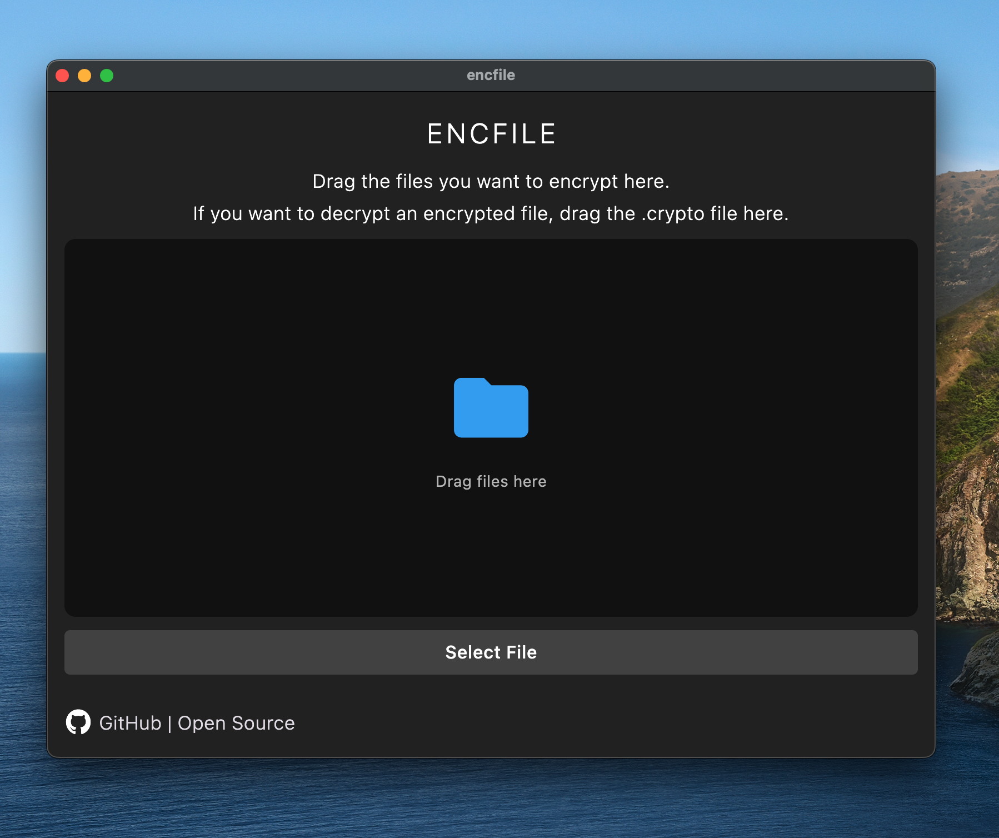
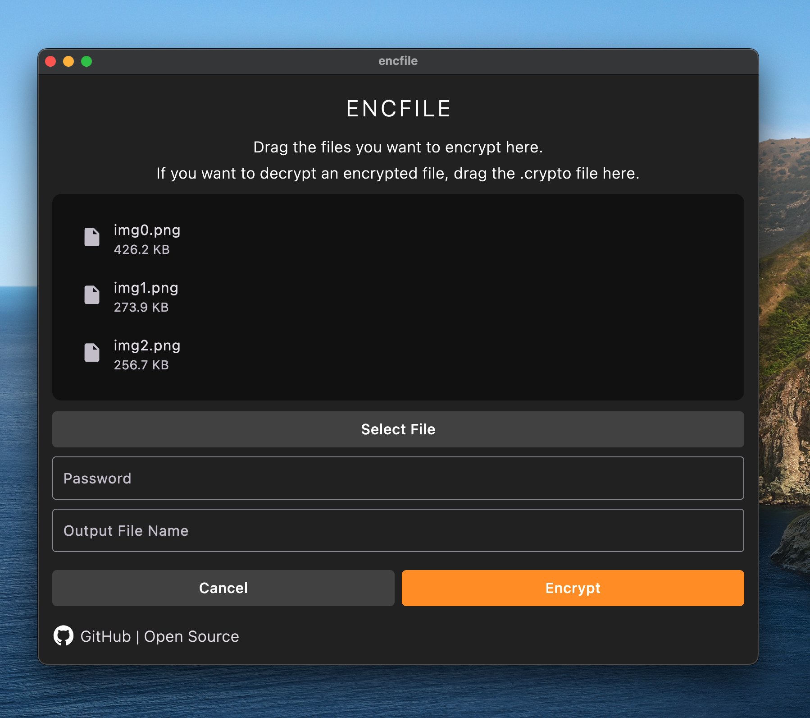
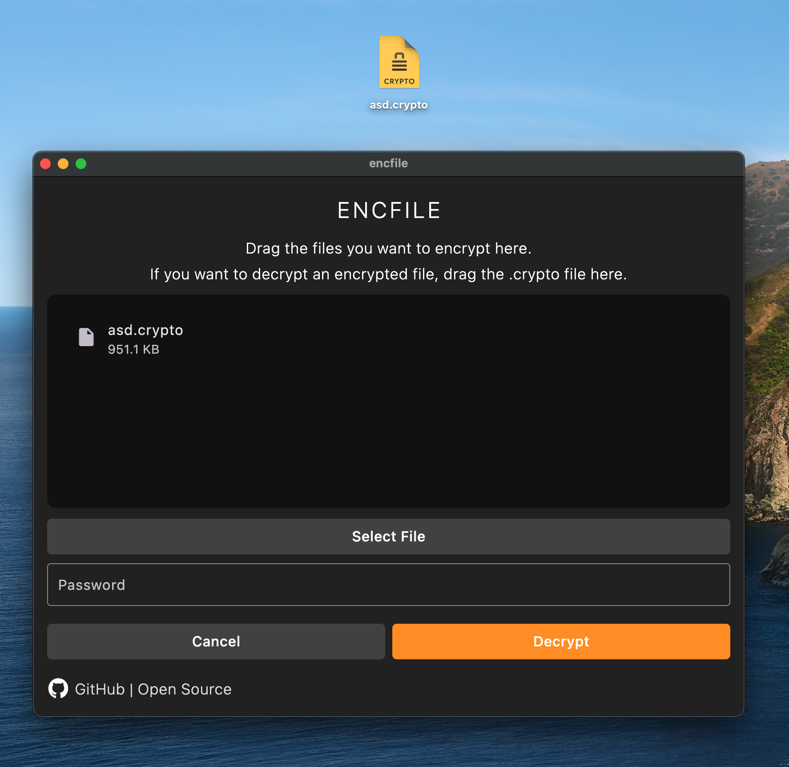
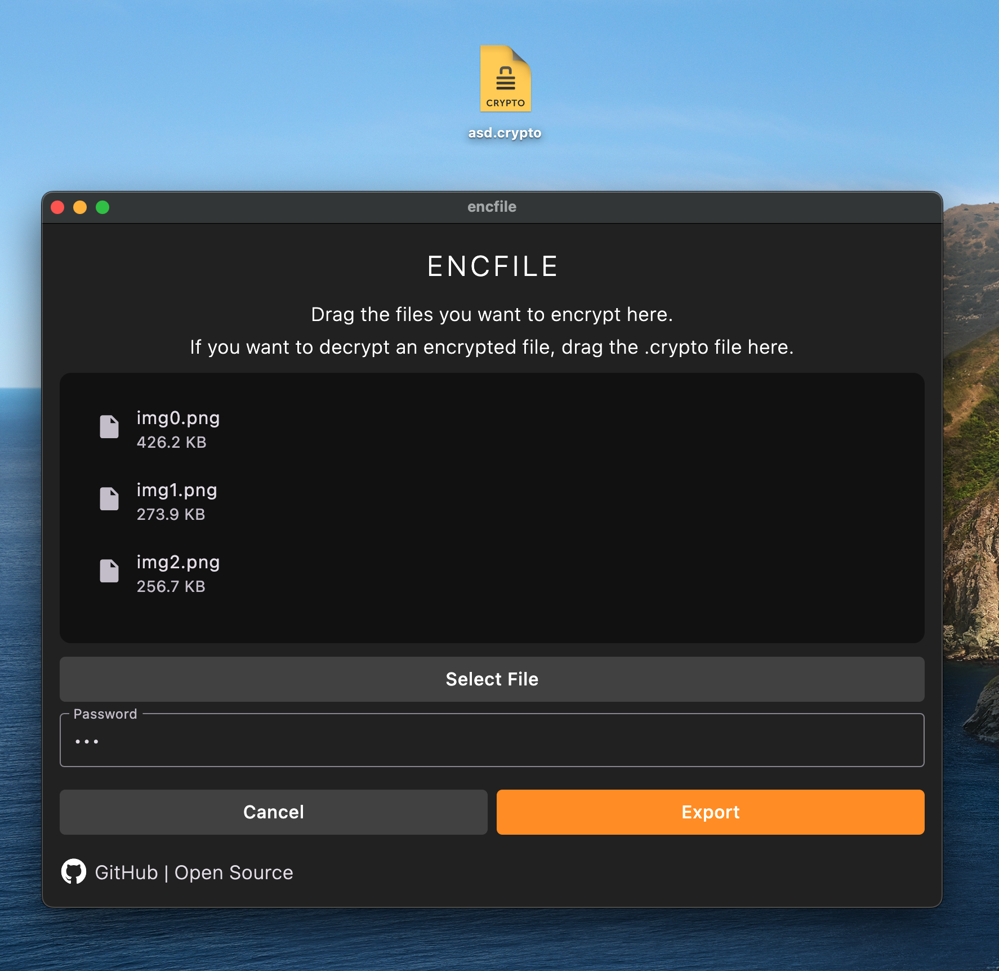

### Languages: &nbsp; [Türkçe](https://github.com/bilalbaz1/encfile/blob/main/README/README-tr.md) &nbsp; &nbsp; [Chinese](https://github.com/bilalbaz1/encfile/blob/main/README/README-zh.md) &nbsp; &nbsp; [Japanese](https://github.com/bilalbaz1/encfile/blob/main/README/README-jp.md) &nbsp; &nbsp; [Russian](https://github.com/bilalbaz1/encfile/blob/main/README/README-ru.md) &nbsp;&nbsp; [Arabic](https://github.com/bilalbaz1/encfile/blob/main/README/README-ar.md)

&nbsp;

# File Encryptor 🚀🔒

This application allows you to encrypt your selected files with the AES-256 algorithm and later decrypt them.  
It supports **Android, iOS, macOS, Windows, and Linux**

---

## Features 🎯
- 📂 Select files by drag and drop
- 🔑 Set a password and encrypt with AES-256
- 🗂️ Create a single `.crypto` file
- 📥 Save directly to the **Downloads** folder on Android/iOS
- 🖥️ Save to the selected location on Windows, macOS, and Linux
- 📤 Easily decrypt the encrypted file
- ✨ Cross-platform support

---

## Usage 👨‍💻

1. Open the application.
2. Drag and drop your files.
3. Enter a password and a new file name.
4. Press the **ENCRYPT** button.
5. The encrypted file will be exported with a `.crypto` extension.

To decrypt:
- Select the encrypted file,
- Enter your password,
- Files will be extracted in their original form.

---

## How It Works? 🖼️

### Select files. Enter password and file name.

### Encrypt.

### Export the encrypted file.


---

## Decrypt a file:

### Select the encrypted file. Enter the password.

### Files will be extracted after decryption.


---

## Installation 🛠️

```bash
# After installing Flutter SDK:
git clone https://github.com/username/file-encryptor.git
cd file-encryptor

# Install packages
flutter pub get

# Run
flutter run -d windows # or android/ios/macos/linux
