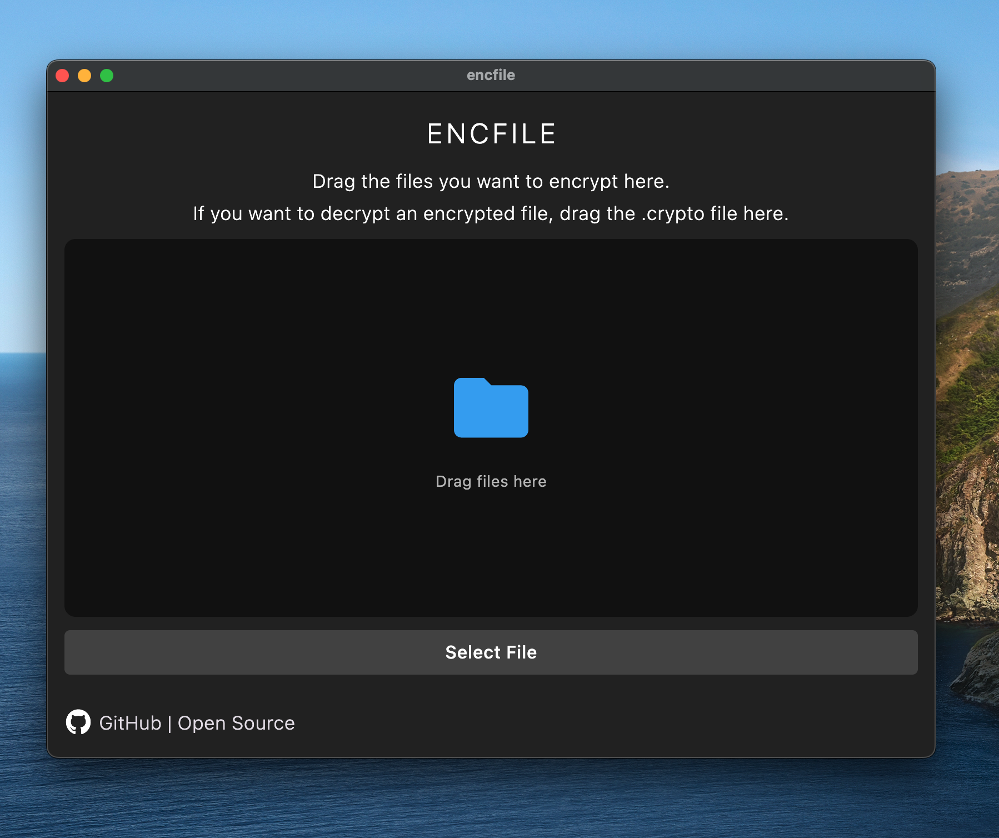
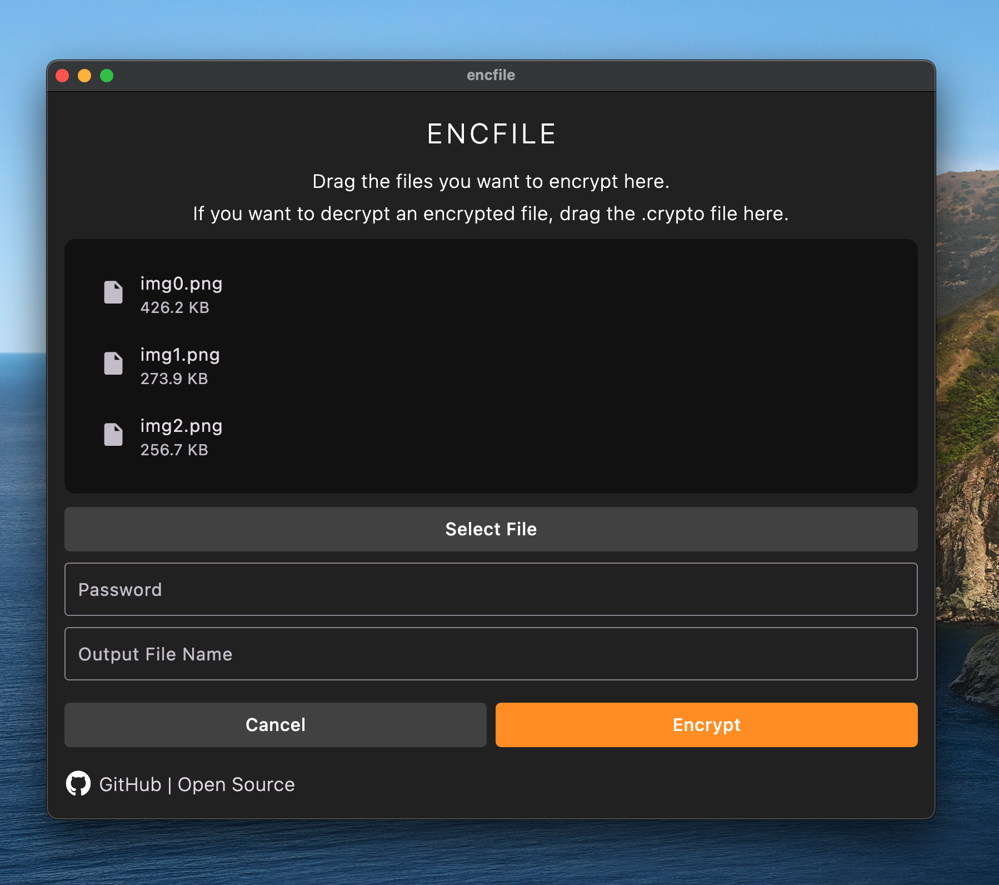
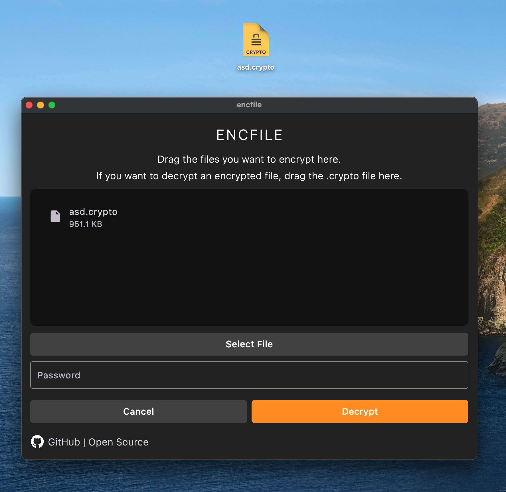
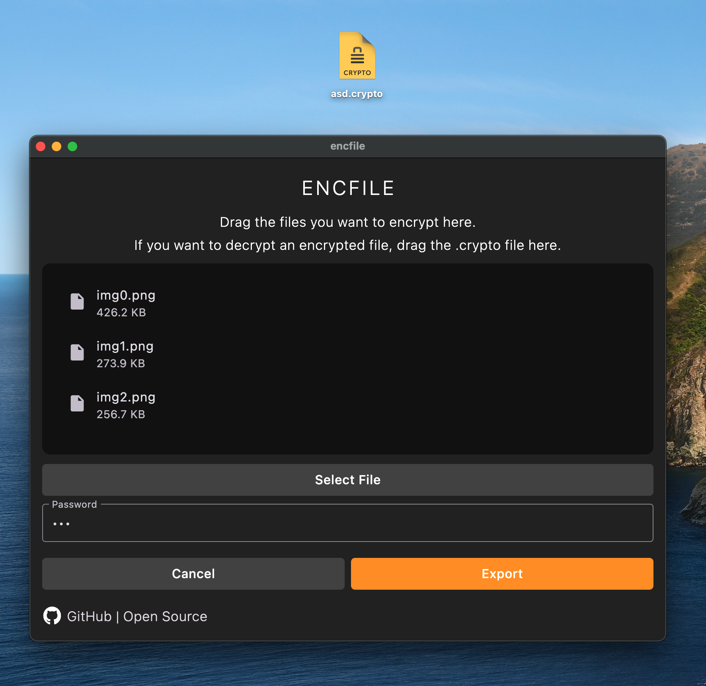

# Dosya Şifreleyici 🚀🔒

Bu uygulama, kullanıcıların dosyalarını güvenli bir şekilde şifreleyip paylaşmalarını sağlar. Kullanıcılar, dosyalarını seçip AES algoritmasının CBC modunu kullanarak bir parola ile şifreleyebilirler. Şifrelenen dosya ".crypto" uzantısıyla kaydedilir ve tüm platformlarda (macOS, Windows, Linux, Android, iOS, web) çalışır. Uçtan uca şifreleme sunmayan platformlarda güvenli dosya paylaşımı ve depolama seçeneği sunar.

---

# Platformlar 💻 📱 🖥️ 🌐
## [🌐 Web Sitesi (çevrimiçi)](https://bilalbaz1.github.io/encfile-web/)
## [💻 MacOS (.dmg)](https://github.com/bilalbaz1/encfile/releases/latest/download/macos.dmg)
## [🖥️ Windows (.exe)](https://github.com/bilalbaz1/encfile/releases/latest/download/windows.exe)
## [📱 Android (.apk)](https://github.com/bilalbaz1/encfile/releases/latest/download/android.apk)
## [📱 Linux (.deb)](https://github.com/bilalbaz1/encfile/releases/latest/download/linux.deb)

---

## Amaç:
Kullanıcıların dosyalarını güvenli bir şekilde şifreleyip paylaşmalarını sağlamak. Uçtan uca şifreleme sunmayan platformlarda güvenli dosya paylaşımı için geliştirilmiştir. 🌐

## Platform Desteği:
Uygulama tüm büyük platformlarda çalışır:
- macOS 🍏
- Windows 💻
- Linux 🐧
- Android 📱
- iOS 🍎
- Web tarayıcıları 🌍

## Dosya Şifreleme Süreci:
1. Kullanıcı şifrelemek istediği dosyaları seçer. 📂  
2. Seçilen dosyalar önce ZIP formatına dönüştürülür. 📦  
3. ZIP dosyası bayt dizisine (byte array) dönüştürülür. 🔄  
4. Kullanıcının belirlediği parola ile AES algoritması (CBC modu) kullanılarak şifrelenir. 🔑  

## Şifreli Dosya Aktarımı:
- Şifrelenen dosya ".crypto" uzantısıyla dışa aktarılır. 📤  
- Kullanıcı bu şifreli dosyayı tekrar uygulamaya yükleyerek şifre çözme işlemi gerçekleştirebilir. 🔓

## Güvenli Depolama:
Uygulama, dosyaların güvenli ve şifreli bir şekilde depolanmasını sağlar. 🛡️

## Kullanım Kolaylığı:
Kullanıcı dostu arayüzü sayesinde herkes kolayca dosya şifreleme ve çözme işlemlerini gerçekleştirebilir. 👩‍💻👨‍💻

## Gizlilik ve Güvenlik:
Uygulama, kullanıcı gizliliğini ön planda tutar ve dosyaların güvenli bir şekilde şifrelenmesini sağlar. 🔒✨

Bu uygulama, kullanıcıların dosyalarını koruyarak güvenli şekilde paylaşmalarına olanak tanırken, basit ve etkili bir deneyim sunar.

---

## Kullanım 👨‍💻

1. Uygulamayı açın.  
2. Dosyalarınızı sürükleyip bırakın.  
3. Bir parola ve yeni dosya adı girin.  
4. **ŞİFRELE** butonuna basın.  
5. Şifrelenmiş dosya `.crypto` uzantısıyla dışa aktarılacaktır.

Şifre çözme işlemi için:
- Şifrelenmiş dosyayı seçin,  
- Parolanızı girin,  
- Dosyalar orijinal halleriyle çıkarılacaktır.

---

## Nasıl Çalışır? 🖼️

### Dosyaları seçin. Parola ve dosya adını girin.


### Şifreleyin.


### Şifrelenmiş dosyayı dışa aktarın.


---

## Bir Dosyanın Şifresini Çözün:

### Şifrelenmiş dosyayı seçin. Parolanızı girin.


### Şifre çözme işlemi sonrası dosyalar çıkarılacaktır.


---

## Kurulum 🛠️

```bash
# Flutter SDK'yı yükledikten sonra:
git clone https://github.com/bilalbaz1/encfile.git
cd file-encryptor

# Paketleri yükleyin
flutter pub get

# Çalıştırın
flutter run -d windows # veya android/ios/macos/linux
